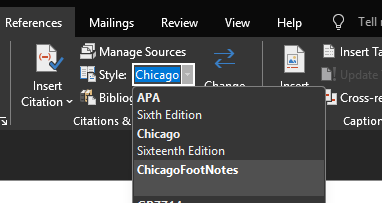

# Directions for use

Locate on your computer where microsoft word stores your formatting styles for citation and bibliographies.

This is usually located at this file path:

`C:\Users\<Fill_Your_UserName_Here>\AppData\Roaming\Microsoft\Bibliography\Style`

Once you've located this file,  
Copy and paste the `ChicagoFootNotes.xsl` file in this repository into the `Style` folder I've just mentioned above

Once you re-open microsoft word, you should see it present under the `References` tab titled, `ChicagoFootNotes`

## Note:
* Only works for the following **Citation** Sources:
  * Books
  * Journal Articles

* Does not work for **Bibliography**
